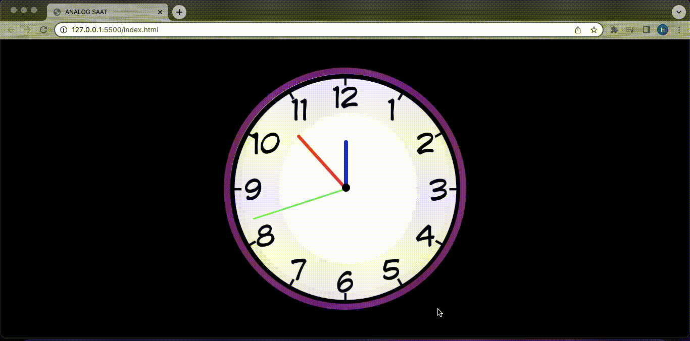

<h1> PROJE:  JAVA SCRIPT İLE ANALOG SAAT YAPIMI  </h1>  

<h2> Proje İçeriği </h2>  

 Bu proje JavaScript öğrenimi için yapılmıştır.  
Projede JS kullanılarak analog saat yapımı denenmiştir.  
    

<h3>  GÖRÜNÜM </h3>  

 
